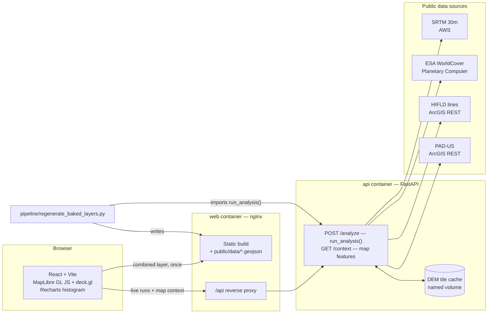

# Solar Siting Explorer

Interactive multi-criteria suitability analysis for utility-scale solar siting.
Draw a study area anywhere in the US, set your own criterion weights, and the
real Python geoprocessing pipeline runs against it on demand — SRTM elevation,
ESA WorldCover land cover, HIFLD transmission lines, and USGS PAD-US protected
areas, combined into a 0–100 score and rendered with MapLibre GL JS + deck.gl.

Built to close a specific skill gap — modern open-source web mapping — on top
of an existing Python/ArcGIS geospatial background. The analysis stays in
Python; the JavaScript renders it.

<!--
  SCREENSHOTS — add three PNGs to docs/screenshots/ and uncomment this block:
    01-overview.png   the pilot AOI with the suitability layer + both panels
    02-draw.png       mid-drag, the draft rectangle visible over the map
    03-live.png       a completed live run, live layer selected, status showing
  A short screen recording of draw → run → result is worth more than all three;
  drop it in as docs/screenshots/demo.gif and lead with it.


-->

## What it computes

Each grid cell gets a 0–100 score from three weighted criteria, with a fourth
dataset applied as a hard exclusion on top.

| Criterion | Source | Scoring |
|---|---|---|
| **Slope** | SRTM 30m, AWS `elevation-tiles-prod` | Linear falloff: 100 at 0°, 0 at `slope_max_deg` (default 10°) |
| **Land cover** | ESA WorldCover 10m, via Microsoft Planetary Computer STAC | Per-class lookup — grassland 90, cropland 80, built-up 5, water 0 |
| **Transmission proximity** | HIFLD Electric Power Transmission Lines (public ArcGIS REST) | Linear falloff: 100 at the line, 0 at `transmission_max_km` (default 10 km) |
| **Protected land** | USGS PAD-US (public ArcGIS REST) | **Exclusion**, not a criterion — overlapping cells keep 5% of their score |

Default weights are **45 / 30 / 25** (slope / land cover / transmission).
Weights are sent as independent 0–100 priorities and normalized server-side to
sum to 1, so the output is always on a real 0–100 scale, and the applied values
come back in the response.

Every criterion is also exported as its own layer, so you can see *why* a cell
scored the way it did rather than only the combined number.

Two implementation details that matter for correctness:

- **Distances are measured in a projected CRS**, not degrees —
  `GeoDataFrame.estimate_utm_crs()` picks the AOI's UTM zone so `.distance()`
  returns metres. A degree is ~111 km north–south but ~88 km east–west at 38°N;
  scoring degrees against a kilometre cutoff would be wrong *and* directionally
  biased, while still producing a plausible-looking map.
- **The transmission query uses a padded bounding box.** An ArcGIS envelope
  query only returns lines intersecting the box you give it, so querying the
  raw AOI would miss a line 500 m outside the edge and score nearby cells as
  unreachable.

## Architecture



The important edge is the dashed one in spirit: **`pipeline/regenerate_baked_layers.py`
imports `run_analysis()` from the backend** rather than reimplementing it. The
pre-baked pilot layers and a live API run are the same computation with the
same defaults by construction — which is the fix for a real bug this project
had (see [Methodology notes](#methodology-notes)).

## Quickstart

### Docker (both halves, recommended)

```bash
docker compose up --build
# → http://localhost:8080
```

`web` serves the built site and reverse-proxies `/api` to `api` over Compose's
internal network, so the browser only ever sees one origin — no CORS involved.
SRTM tiles are cached in a named volume, so repeat runs over the same area skip
the download.

### Local dev

Two terminals. First the API:

```bash
cd backend
python3 -m venv venv && source venv/bin/activate
pip install -r requirements.txt
uvicorn main:app --reload --port 8000
```

Then the frontend:

```bash
npm install
npm run dev          # → http://localhost:5173
```

Vite proxies `/api` to `localhost:8000` (see `vite.config.js`), so the app code
uses the same single URL it does in Docker. The map and all pre-baked layers
work without the API running; only **Run analysis** needs it, and the panel
tells you up front if it's unreachable.

### Regenerating the pre-baked layers

```bash
cd pipeline
python3 regenerate_baked_layers.py     # needs network; backend deps
```

Rebuilds every file in `public/data/` for the pilot AOI in a single pass. This
is the canonical path — the older `m3` / `m5` / `t_` / `t3` scripts are kept as
a record of how the pipeline was built up milestone by milestone, but they're
marked SUPERSEDED and encode an older methodology.

## Using it

- **Draw AOI** arms rectangle-drawing; drag on the map, `Esc` cancels. The
  readout tracks the draft box live, including its area against the API's
  1 sq° cap, so you find out you've drawn something too large before releasing
  the mouse.
- **Criterion weights** are relative priorities — the panel shows the
  normalized shares that will actually be applied.
- **Run analysis** calls the API. This takes real seconds (SRTM fetch,
  WorldCover window, then scoring), hence the elapsed timer and cancel button —
  unlike every control in the Layers panel, which is instant client-side
  symbology.
- **The histogram is a filter.** Click a bar to select that score range, drag
  across several for a wider one. Out-of-range cells fade rather than disappear,
  so the AOI's shape stays legible. Click the same selection again to clear.
- **Copy link to this analysis** puts the AOI and every parameter in the URL.
  Reopening it restores the study area and zooms the map to it.
- **Both panels collapse** to a header via the chevron, remembered per browser.
  A folded Analysis panel still reports a run in progress and its result.
- **Everything is keyboard operable.** The score layers are a radiogroup
  (arrow keys, Home/End); layer toggles and mode switches are buttons.

## API

`POST /api/analyze` (or `:8000/analyze` directly)

```jsonc
{
  "bbox": [-97.05, 37.70, -96.70, 37.95],  // [west, south, east, north], required
  "slope_max_deg": 10.0,
  "slope_weight": 45,          // relative; normalized server-side
  "landcover_weight": 30,
  "transmission_weight": 25,   // 0 skips the HIFLD query entirely
  "transmission_max_km": 10.0,
  "apply_exclusions": true,
  "grid_cols": 144,
  "grid_rows": 120
}
```

Returns a GeoJSON `FeatureCollection`. Each feature carries `score` plus the
per-criterion values behind it (`slope_score`, `landcover_score`,
`transmission_score`, `slope_deg`, `landcover_class`, `transmission_km`,
`excluded`), and a top-level `metadata` member reports the normalized weights,
how many lines and protected areas were found, the excluded-cell count and the
mean score.

`GET /api/context?bbox=w,s,e,n` returns the transmission lines and protected
areas for a map window — display only, no scoring, so it answers in about a
second. The frontend calls it as you pan, which is what makes drawing a study
area outside the pilot area useful: the infrastructure the score is measured
against is actually on screen. It reuses the same ArcGIS queries and the same
10 km padding as the scoring path, so what's drawn is what's measured. Windows
above 6 sq° are rejected; the frontend also refuses below zoom 8.

`GET /api/health` → `{"status": "ok"}`.

Errors are FastAPI `{"detail": "..."}`: `400` for a bad or oversized AOI,
`502` when an upstream data source fails. The messages are written to be shown
to a user as-is.

## Project layout

```
src/
  components/   MapView (map + deck.gl + state), LayersPanel, AnalysisPanel, ScoreHistogram
  lib/          bboxDraw (rectangle drawing), api (fetch client), urlState (permalinks), colorRamps
  styles/       glass.css — the glassmorphism design system, one variable set per theme
backend/
  suitability.py    run_analysis() — the single source of truth for scoring
  main.py           FastAPI wrapper
pipeline/
  regenerate_baked_layers.py   canonical: rebuilds public/data/ via run_analysis()
  m3_/m5_/t_/t3_               SUPERSEDED; kept as build history
public/data/      pre-baked GeoJSON. The app downloads only
                  suitability_score.geojson and derives the criterion layers
                  from its sub-score columns; the standalone criterion files
                  are written for direct use (QGIS et al.), not for the app
nginx.conf        static serving + /api proxy for the web image
```

## Methodology notes

**Transmission proximity was described before it was implemented.** For a
while, this project's write-up claimed a four-criterion score while the code
computed two: the HIFLD lines were fetched and drawn on the map, but never
scored. The cause was three copies of the scoring logic — the batch script, the
script that layered exclusions on its output, and later the API — which is
exactly how an implementation and its documentation drift apart without anyone
lying. It's fixed structurally: one `run_analysis()`, imported by the batch
script rather than reimplemented, and the criterion now genuinely exists.

**The score is a demonstration, not a siting recommendation.** Real siting
analysis needs land ownership and parcel geometry, interconnection queue
position and available substation capacity (proximity to a line is a poor proxy
for whether you can actually connect to it), setback and zoning rules,
floodplain and wetland delineation, solar resource (GHI/DNI), and slope
*aspect*, not just magnitude. The weights here are defaults chosen to be
explainable, not calibrated against anything.

**Known limitations.** SRTM's 30m is coarse next to USGS 3DEP for most of the
US. AOIs are capped at 1 square degree because the grid-averaging step is an
O(rows × cols) Python loop. Map browsing outside the pilot area needs the API
running, since that's where the infrastructure overlays come from.

## Data sources

All public, no API keys or accounts required:

- **SRTM 30m elevation** — [AWS Terrain Tiles](https://registry.opendata.aws/terrain-tiles/)
- **ESA WorldCover 10m** — via [Microsoft Planetary Computer](https://planetarycomputer.microsoft.com/dataset/esa-worldcover)
- **HIFLD Electric Power Transmission Lines** — public ArcGIS Feature Service
- **USGS PAD-US** — public ArcGIS Feature Service
- Basemaps: [CARTO](https://carto.com/basemaps/) vector styles, Esri World Imagery
